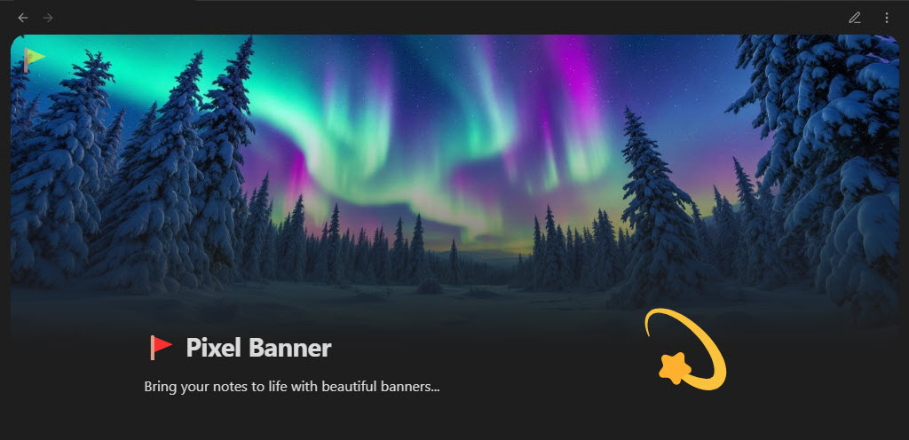

# 🚩 Pixel Banner for Obsidian

Pixel Banner is a powerful Obsidian plugin that transforms your notes with customizable banner images, creating visually stunning headers that enhance your knowledge workspace. Go beyond simple note-taking with banners that provide visual context and improved aesthetics.

### Maintained by

 

## Key Features

### ✨ Smart Banner Creation
- **AI-Generated Banners**: Create stunning, custom banners using AI generation without design skills.
- **Banner Collection**: Browse and use professional banner images and videos from the integrated Pixel Banner Plus Collection, including many free options.
- **3rd Party APIs**: Connect to Pexels, Pixabay, Flickr, and Unsplash to automatically fetch banner images based on keywords.
- **Local Image Support**: Use images from your vault as banners with advanced customization options.
- **Video Banner Support**: Add dynamic MP4 and MOV videos from your vault as animated banners, with full download support from the Pixel Banner Plus Collection.
- **Direct URL Banners**: Apply banners from any web URL for maximum flexibility.
- **Note Properties Integration**: Control all banner aspects through Obsidian's `properties` feature.

### 🎨 Visual Customization
- **Position Control**: Fine-tune banner placement with precise vertical and horizontal positioning for perfect alignment.
- **Appearance Options**: Customize transparency, border radius, animation effects, and spacing for seamless integration.
- **Display Flexibility**: Choose between display modes (cover, auto, contain) with options for repetition and sizing.
- **Banner Icons**: Add and customize decorative icons with control over size, position, color, background, and style.
- **Title Integration**: Style in-line titles with custom colors that complement your banner designs.
- **Hide Frontmatter**: Automatically hide banner-related fields in reading view for a cleaner look.

### ⚡ Efficient Workflow
- **Banner Selection Modal**: Quick visual picker for local images with sorting options.
- **Command Integration**: Access all banner functions via command palette and hot keys.
- **Quick Action Icons**:
    - **Select**: Quickly choose a banner source.
    - **Pin**: Save a banner from a URL or API as a local file.
    - **Refresh**: Get a new image from the same keyword or URL.
    - **View**: Open the full banner image in a modal.
- **Custom Field Names**: Rename any banner property field to fit your workflow.

### 📂 Smart Organization
- **Folder-Specific Settings**: Configure default banner behavior per folder.
- **Image Shuffling**: Automatically rotate through images in specified folders.
- **Direct Children Option**: Apply settings only to immediate folder contents.
- **Default Saved Banners Folder**: Configurable default location for saving downloaded banners from the collection or pinned from APIs.
- **File Extension Preservation**: Automatically saves banners with correct file extensions (.jpg, .png, .gif, .svg, .mp4, .mov).

### 🎬 Video Banner Features
- **Video File Support**: Full support for MP4 and MOV video files as animated banners.
- **Video Collection**: Download and use professional video banners from the Pixel Banner Plus Collection.
- **Smart UI Elements**: Video banners display with distinct badges and play icons for easy identification.
- **Flexible Saving**: Choose custom save locations and filenames when downloading video banners.
- **Seamless Integration**: Videos work with all existing banner features (positioning, sizing, icons, etc.).

### 💎 Premium Features (Pixel Banner Plus)
- **Token-Based System**: Generate AI banners with a flexible pay-as-you-go model.
- **Banner History**: Access your previously generated banners.
- **Prompt Inspiration**: Get AI assistance with banner ideas.
- **Daily Game**: Play a fun daily game to earn banner tokens.
- **No Subscription Required**: Purchase tokens only when needed.

Enhance your Obsidian experience with beautiful, intelligent banners that make your notes visually distinctive and organized. Whether you prefer AI-generated art, professional designs from the store, or your own images, Pixel Banner helps create a visually cohesive knowledge base.

## 🔧 Installation

1. Open Obsidian and go to Settings
2. Navigate to Community Plugins and disable Safe Mode
3. Click on Browse and search for "Pixel Banner"
4. Install the plugin and enable it

## 🚀 Basic Workflow

1. Open a note and click the `Banner Flag` in the top left corner of your Note  

    

2. Select a `Source` for your Banner (the AI and Collection options require you to first create a FREE Pixel Banner Plus account at: https://pixel-banner.online)  

    

3. _Optionally_ Add an `Icon Image` (choose from your vault, the web, or our online free collection)

    

4. _Optionally_ Add `Icon Emoji & Text` (this can be any text, but it is advised to use an Emoji 🤣)

    

5. _Optionally_ adjust the `position`, `size`, `color`, and other `properties` for the `Banner Image` and `Banner Icon` of the note (by default they will inherit the General settings in Pixel Banner's main setting page, but are customizable per note)

    

6. Click the `Banner Flag` icon anytime to adjust any of these settings (the GUI is the most user-friendly way to adjust a note's pixel banner settings though you can also access and modify them through the `properties` of the note)

    

## 🎬 Working with Video Banners

### Adding Video Banners
1. **From Your Vault**: Select video files (.mp4, .mov) from your vault just like images
2. **From Collection**: Browse video banners in the Pixel Banner Plus Collection (marked with video badges)
3. **Download & Save**: Videos are automatically saved with correct file extensions and you can choose the save location

### Video Banner Features
- **Smart Badges**: Video banners display with "VIDEO" badges for easy identification
- **Seamless Experience**: All existing banner features work with videos (icons, positioning, etc.)
- **Flexible Saving**: Choose where to save downloaded videos and customize filenames

### 🎉 Happy Pixel Bannering 🤣

---

## Appreciation
If you enjoy `Pixel Banner` please consider sending me a tip to support my work 😀
# [🍵 tip me here](https://ko-fi.com/jparkerweb)
Any `ko-fi` donator automatically recieves free `Tokens` to spend in Pixel Banner Plus!

## Feedback and Support

If you encounter any issues or have suggestions for improvements, please [open an issue](https://github.com/jparkerweb/pixel-banner/issues) on the GitHub repository.
